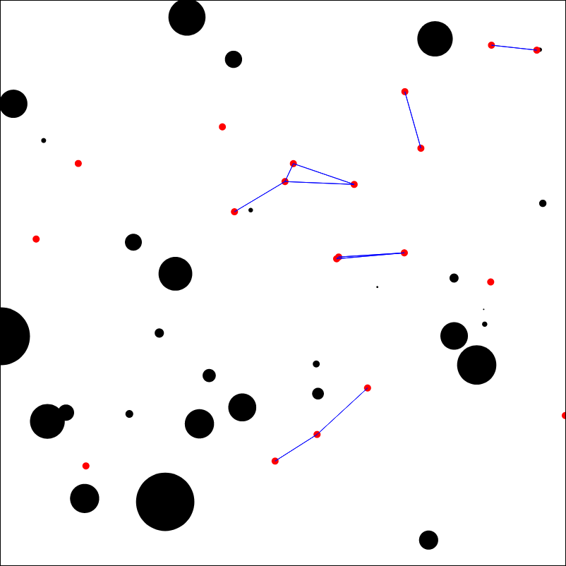

# Robot Swarm Simulation for Oil Spill Cleanup

This repository contains the code for a robot swarm simulation that uses percolation and blocking mechanisms of network cascades to control robot swarming. The primary goal is to efficiently clean up oil spills through a guided self-organized criticality approach. This simulation showcases how reinforcement learning can be applied to manage and optimize robot interactions for environmental cleanup tasks.

## Description

The simulation leverages the principles of percolation theory and network cascades to guide the swarm of robots in cleaning up oil blobs. By adjusting various parameters such as robot count, blob size, and connection probabilities, users can observe how different configurations affect the efficiency and behavior of the swarm. This model acts as a foundation for studying more complex behaviors in swarm robotics and can be extended to other areas such as disaster response or distributed sensing.

## Features

- Interactive sliders to control the number of robots, number of oil blobs, blob sizes, and other critical simulation parameters.
- Real-time adjustments to the simulation's speed and robot thresholds.
- Visualization of robot and oil blob positions on a scalable vector graphics (SVG) canvas.
- Implementation of guided self-organized criticality through local interaction rules.

## Theoretical Background

This model draws inspiration from Duncan J. Watts' influential paper "A Simple Model of Global Cascades on Random Networks", which explores the dynamics of global cascades in complex networks. By applying principles from this paper, the simulation provides a framework for understanding how minor changes in network structure can lead to different outcomes in swarm behavior.

## How to Run the Simulation

The simulation can be run directly from your web browser. Access the live version [here](http://galenwilkerson.github.io/robot_swarm_3.html).

## Repository Structure

- `robot_swarm_3.html`: Main HTML file containing the simulation setup, parameters, and the interactive interface.

## Contributing

Contributions to enhance the simulation, such as adding new features, improving the user interface, or optimizing the underlying algorithms, are welcome. Please feel free to fork the repository, make changes, and submit a pull request.

## License

This project is licensed under the MIT License - see the LICENSE.md file for details.

## Author

- **Galen Wilkerson**

## Acknowledgments

This work uses concepts of percolation theory and network cascades to inspire solutions to real-world problems, like environmental cleanup. We appreciate all contributions and feedback to help improve this simulation.

